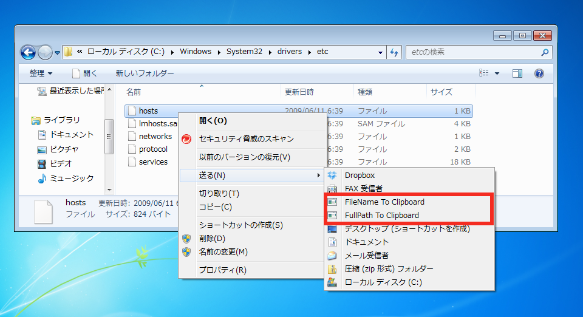

SendToClipboard
=======================
`Send To' clipboard application for Windows.

Right-click of the file and select menu. (You can choose multiple files)
  

## Installer

[SendToClipboard-1.0.0.msi](https://s3-ap-northeast-1.amazonaws.com/sendtoclipboard/release/SendToClipboard-1.0.0.msi) (240KByte)

## Support OS

Windows XP/Vista/7/8 (.NET Framework 3.5)

## Open Source

This software is distributed under the BSD-style license.

## Development tool

- Visual Studio 2012 C#
- WiX toolset v3.7
